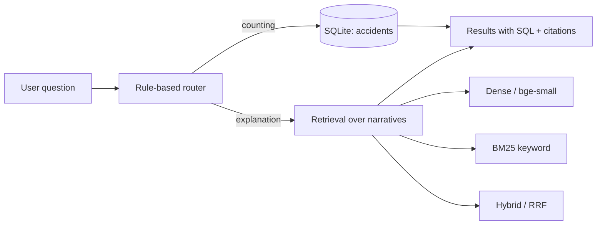
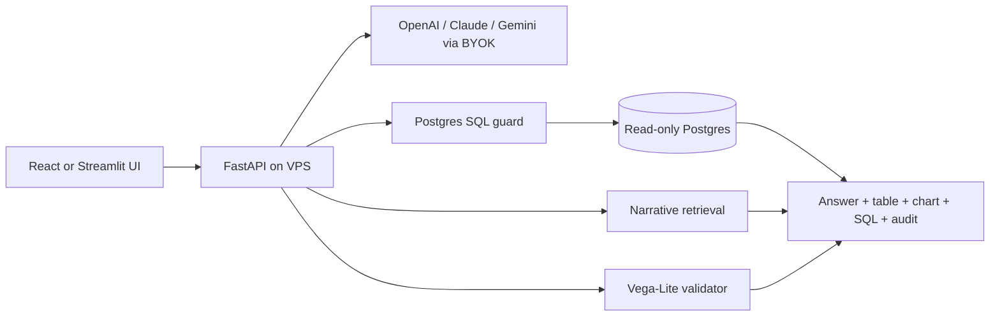

# Black Box AI - Natural-Language Aviation Safety Analytics

Question answering over 7,462 US NTSB aviation accident final reports (2016-2023),
across a **structured table** (counts and statistics) and the **accident narratives**
(semantic and keyword search). The name is deliberately ironic: a flight recorder is
a "black box," but this system is the opposite of one. Every statistic is shown with
the exact SQL that produced it, and every report is cited to its official NTSB record,
so nothing is hidden behind generated prose.

**Live demo:** <https://huggingface.co/spaces/account-name/ntsb-blackbox>

---

## What this is

Aviation safety questions come in two shapes, and they need different engines:

- "How many fatal accidents happened in 2019?" is a **counting** question. It is
  answered exactly, by SQL, against a structured table.
- "Why do pilots lose control in icing conditions?" is an **explanation** question.
  Its answer lives in the free text of the reports, so it is answered by retrieval
  over the narratives.

The project builds both halves over the same dataset (a shared NTSB accident number
joins a row in the table to its narrative), and routes questions to the right one.

The production direction is **natural-language aviation safety analytics**: users ask
plain-English questions about the NTSB accident corpus, and the backend decides whether
to search narratives, run SQL, build a chart, or combine those paths. The upgraded
server version is designed around guarded Postgres SQL, cited retrieval, user-provided
model keys, validated Vega-Lite charts, and an audit trail.

## Design principles

These are the things worth looking at, and the reasons behind them:

1. **Numbers come from SQL, never generated.** Every statistic in the app is the
   result of a hand-written query, displayed alongside the query itself. There is no
   path by which a number can be invented.
2. **Retrieval is measured, not assumed.** Three retrieval strategies (dense semantic,
   BM25 keyword, and a Reciprocal Rank Fusion hybrid) were evaluated against a
   hand-labeled query set. See the findings below, which did not match the initial
   hypothesis.
3. **Everything is cited.** Search results link to the official NTSB report for each
   accident, and lead with the NTSB's own probable-cause statement.
4. **The public demo runs no LLM, by design.** A public link that called a paid model
   on every query would carry a real cost and abuse risk. Scoping the demo to retrieval
   and prebuilt queries removes both, and puts the engineering on display rather than
   hiding it behind generated text. Text-to-SQL and answer synthesis are documented as
   a local extension (see Limitations).
5. **The server rebuild treats models as planners, not authorities.** Generated SQL is
   parsed as Postgres and validated before execution (`src/sql_guard.py`). Generated
   charts are validated against the real dataframe schema (`src/chart_validator.py`).
   BYOK utilities keep provider keys session-scoped and redact them from errors
   (`src/providers.py`).

## Architecture



Planned VPS/server architecture:



Pipeline:

- **Ingest** (`src/ingest.py`): parses the source CSV (semicolon-delimited,
  multi-line quoted text), builds a SQLite table of structured fields, and writes one
  narrative text file per accident.
- **Index** (`src/build_index.py`): chunks the narratives, embeds them with
  `BAAI/bge-small-en-v1.5`, and saves a vector index (`data/index/`).
- **Retrieval** (`src/search.py`, `src/bm25_search.py`, `src/hybrid_search.py`):
  dense cosine search, BM25 keyword search, and RRF fusion, all over the same chunks.
- **Router** (`src/router.py`): a transparent rule-based classifier that labels a
  question SQL, retrieval, or both.
- **Structured queries** (`src/sql_tool.py`): a fixed menu of prebuilt analyses.
- **App** (`app.py`): a Gradio interface that ties it together. The public demo
  exposes retrieval (free text) and the prebuilt analyses (a menu), so free text never
  reaches the database.

## Evaluation and findings

A hand-labeled set of 17 queries (`eval/questions.jsonl`) was scored against all three
retrievers (`eval/run_eval.py`), at the accident level.

| Retriever       | Recall@5 | MRR   | Hit@5 |
|-----------------|----------|-------|-------|
| Semantic        | 0.335    | 0.853 | 1.000 |
| Keyword (BM25)  | 0.339    | 0.897 | 1.000 |
| Hybrid (RRF)    | 0.327    | 0.902 | 1.000 |

**The finding did not match the hypothesis, which is the point.** The initial
expectation was that hybrid retrieval would win. It did not. The three strategies are
statistically indistinguishable in aggregate, and hybrid was in fact the lowest on
recall. Digging into the per-query results explained why:

- **RRF is a consensus mechanism, not "best of both."** It helps when both engines are
  partially right and complementary, but it actively hurts when one engine is decisively
  right and the other decisively wrong, because it blends the wrong engine's confident
  results in and pushes the correct ones out. On a "bird strike" query where semantic
  scored 0.80 and keyword 0.40, hybrid dropped to 0.20.
- **Most queries did not need fusion.** On this corpus the search term usually appears
  in the report text, so keyword and semantic already agree; there was little
  disagreement for fusion to resolve.
- **Two metrics carried no signal here.** Hit@5 saturated at 1.0 for all engines (the
  corpus is dense, so finding *something* relevant is trivial), and three
  topic-saturated queries (hard landing, carburetor icing, gear collapse) had 20-plus
  relevant reports each, capping Recall@5 near 0.25 for everyone.

**Conclusion:** hybrid retrieval is insurance for query types you cannot anticipate,
not a universal upgrade. On a corpus where the answer term reliably appears in the text,
a single retriever is competitive, so the demo defaults to semantic and offers all three
for comparison. This was a design decision driven by measurement, not assumption.

## A genuine safety insight from the data

The structured analyses surface a real result: landing is by far the most common phase
of flight for accidents (about 2,575), but in **fatal** accidents the order inverts, and
enroute (295) and maneuvering (290) lead while landing drops to 37. Most accidents happen
on landing, but the ones that kill happen enroute and while maneuvering.

## Repository structure

```text
ntsb-blackbox/
  app.py                  # Gradio demo (public-facing)
  requirements.txt
  pyproject.toml          # pytest config (puts src/ and eval/ on the import path)
  README.md
  src/
    paths.py              # every data-file location, plus the missing-data error
    ingest.py             # CSV -> SQLite + per-accident narrative files
    build_index.py        # chunk + embed narratives -> vector index
    search.py             # dense semantic retrieval
    bm25_search.py        # BM25 keyword retrieval
    hybrid_search.py      # Reciprocal Rank Fusion of the two
    dedup.py              # collapse chunk-level hits into accidents (shared)
    router.py             # rule-based SQL / retrieval / both classifier
    sql_tool.py           # prebuilt structured analyses
    schema_catalog.py     # approved SQL/chart schema and column capabilities
    sql_guard.py          # Postgres-dialect SELECT-only validator
    chart_validator.py    # Vega-Lite spec validator
    providers.py          # BYOK provider normalization, redaction, session store
    ui_helpers.py         # chart / result-card helpers, unit-testable on their own
    compare.py            # CLI: one query through all three engines, side by side
  tests/                  # pytest suite; runs without the local data files
  eval/
    questions.jsonl       # hand-labeled evaluation set
    router_cases.jsonl    # starter route evaluation cases
    sql_cases.jsonl       # starter SQL generation evaluation cases
    chart_cases.jsonl     # starter chart generation evaluation cases
    run_eval.py           # scores the three retrievers
    label.py              # labeling tool
  docs/
    architecture.md       # VPS/Postgres production architecture
    deployment.md         # VPS deployment notes
    security.md           # BYOK, VPS, SQL, and chart security model
    evaluation.md         # router, SQL, chart, and citation evaluation plan
    limitations.md        # dataset, modeling, and product limitations
  data/                   # built locally, not committed
    ntsb.db
    index/
```

## Running it

```bash
pip install -r requirements.txt

# 1. Get the data: download the source CSV from Zenodo record 17096333 into data/raw/
# 2. Build the structured DB and narrative files
python src/ingest.py
# 3. Build the vector index (GPU recommended; a one-time job)
python src/build_index.py
# 4. Run the app
python app.py
```

Run the FastAPI backend:

```bash
uvicorn backend.app.main:app --host localhost --port 8000
```

Run the React frontend:

```bash
cd frontend
npm install
npm run dev
```

Load the local SQLite data into Postgres for a VPS:

```bash
python scripts/load_postgres.py \
  --database-url "postgresql://<loader-db-role>:<loader-db-password>@localhost:5432/ntsb_blackbox"
```

Update Postgres from a refreshed NTSB CSV snapshot:

```bash
python scripts/update_ntsb.py \
  --database-url "postgresql://<loader-db-role>:<loader-db-password>@localhost:5432/ntsb_blackbox" \
  --source-csv data/raw/latest_ntsb_reports.csv \
  --dry-run

python scripts/update_ntsb.py \
  --database-url "postgresql://<loader-db-role>:<loader-db-password>@localhost:5432/ntsb_blackbox" \
  --source-csv data/raw/latest_ntsb_reports.csv
```

The updater is idempotent: it hashes each source record, writes only changed rows and
narratives, records each run in `ingest_runs`, and rebuilds retrieval indexes only when
the corpus changes.

See `docs/deployment.md` for the full VPS shape.

The test suite needs no data files (database-dependent tests skip themselves):

```bash
python -m pytest
```

## Data

US NTSB aviation accident final reports, 2016-2023, public domain. Sourced as a
consolidated CSV from Zenodo (record 17096333). Two notes that matter for reading the
charts:

- **2020 and 2021 are absent** from this particular dataset.
- **Recent years are still filling in.** NTSB final reports take a year or more to
  publish, so the 2023 count is low because of investigation lag, not a safety
  improvement.

## Limitations and future work

Stated plainly, because knowing where a system is imperfect is part of building it well:

- **Manufacturer entity resolution is partial.** `UPPER()` fixes casing, and a curated
  alias map (`MAKE_ALIASES` in `sql_tool.py`) merges high-volume variants such as the
  three spellings of Robinson. The long tail of less common variants is not resolved.
  Full resolution would need fuzzy matching with human review.
- **Multi-aircraft records carry concatenated fields.** Roughly 100 accidents involving
  more than one aircraft store two values in one field (for example `number_of_engines`
  as `1, 1`), which is why some columns load as text. These are not specially handled.
- **The evaluation set is small.** 17 queries, a single labeler, and relevance judged
  against a pooled candidate set (truly relevant reports that no engine surfaced cannot
  be labeled). Results are directional, not definitive.
- **The router is rule-based and brittle.** It matches words, not meaning, so it
  misroutes when a counting word points at a concept that only exists in the narrative
  text ("how many accidents were caused by spatial disorientation"). An LLM classifier
  that sees the schema is the planned upgrade, and would be measured against the current
  router.
- **The public demo has no answer synthesis.** Text-to-SQL (turning free text into
  queries) and natural-language answer generation exist as a local extension where the
  model key is controlled, and are kept out of the public link deliberately to avoid
  token cost and abuse surface.
- **The production rebuild is targeted at a VPS with Postgres.** SQLite remains useful
  for local ingestion and the no-LLM demo, but the hosted server should execute
  generated analytical SQL through a read-only Postgres role after validation.

## License

Code: MIT. Data: US Government public domain (NTSB).
